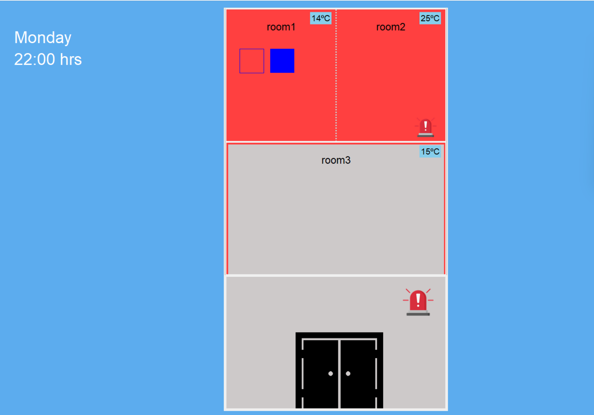

# SBC_Sistema-Expert
## Table of Contents
  - [Overview](#overview)
  - [Installation](#installation)
  - [Dependecies](#dependencies)
  - [Input files](#input-files)
  - [Usage](#usage)
  - [Visualization](#visualization)
  - [Example](#example)
  - [Group members](#group-members)
  - [References](#references)

## Overview 
This Python and Prolog program simulates an expert system that monitors and integrates functions for effective building climate management, ensuring optimal temperature, air quality, energy efficiency, and rapid detection of security and infrastructure issues.

The Python project additionally offers visualization capabilities to inspect the final state of the building. 


## Installation
Project can be downloaded from the attached folder or by clonning our GitHub repository:


```bash
git clone https://github.com/gpol2003/SBC_Sistema-Expert.git
```
## Dependencies
### Python
You can download these libraries by typing this command in terminal:
```bash
pip install <library_name>
```
Project dependecies:
+ **json**: to read input file filled with initial condictions
+ **Tkinter**: to creaate visual interface based in shapes and represent the building status.
+ **Pillow**: to load and place images in the visual interface created with Tkinter.

## Usage
### Prolog
To execute the Prolog code you can place the code in this [online interpreter](https://swish.swi-prolog.org/).

Once the code is placed, copy one test also and in the right tab you can see the state of some building device, for example:

```prolog
llum(room1)
```
### Python

To execute the python code you have several ways:

#### From Linux terminal
Download Python 3 by running this command on terminal.

```bash
sudo apt-get install python3.8
```
Then execute the code:
```bash
cd Python
python main.py
```
#### From Juppiter Notebook
Place the code and input files for example in [Google Colab](https://colab.research.google.com/?hl=es).

#### Visual Studio Code
Install Python3 from [official website](https://www.python.org/downloads/), add Python extension to [VS Code](https://code.visualstudio.com/docs/languages/python) and run the code by typing on Windows terminal:
```bash
cd Python
python main.py
````
## Input files
In order to set the initial conditions of de building you have to add a json file to de Pyton/data folder (there are some test files).

### Format
The json file must have the following format:
```bash
{
    "day": <day> (string),
    "time": <time> (int),
    "temperature": <temperature> (int/float),
    "building": {
        "floors": [
        {
            "name": <floor_id>,
            "rooms": [
                {
                    "name": <room_id>,
                    "busy": <occuppied> (boolean),
                    "temperature":<temperature> (int/float),
                    "windows": [
                        {
                            "name": <window_id>,
                            "open": <oppened> (boolean)
                        },
                        <another_window>,
                        ...
                    ]
                },
                <another_room>,
                ...

            ]
        },
        <another_floor>,
        ...
        ]
    }
  }
```

### File example
```json
{
    "day": "Monday",
    "time": 10,
    "temperature": 23,
    "building": {
        "floors": [
        {
            "name": "floor1",
            "rooms": [
                {
                    "name": "room1",
                    "busy": true,
                    "temperature": 14,
                    "windows": [
                        {
                            "name": "window1",
                            "open": true
                        },
                        {
                            "name": "window2",
                            "open": false
                        }
                    ]
                },
                {
                    "name": "room2",
                    "busy": true,
                    "temperature": 25,
                    "windows": [
                    ]
                }

            ]
        }, 
        {
            "name": "floor2",
            "rooms": [
                {
                    "name": "room3",
                    "busy": false,
                    "temperature": 15,
                    "windows": [

                    ]
                }
            ]
        }
        ]
    }
  }
```
## Visualization
When the main code is executed, a new tab will open with the visual interface created from the JSON file. The meaning of each element that can be observed is then detailed below:

+ For each floor of the building, we can see the rooms it contains along with their names and the number of windows they have.
+ To differentiate between closed and open windows, the first are completely painted in blue, while the second only have the frame in this color.
+ Regarding the rooms, we can also find out the temperature and check if there is any activated device (heating, air conditioning, ventilation, or artificial light).
+ The building floors are equipped with an alarm system, and if it is active, an icon is displayed in the last room.
+ Additionally, the entire block also has an alarm system that can be either active or inactive. If it is active, an icon would be visible next to the door.
+ As mentioned, the building has a door that can be either open or closed. The status of this can be known by observing the door drawn when the program is executed.
+ If the weather is temperate, the background of the visual interface is pink; if it is cold, the background is painted in blue, while in hot weather, it is painted yellow.
+ Finally, in the upper left corner, you can find the current day of the week and time.

## Example



## Group members
Andrea Ballester Griful - andrea.ballester@students.salle.url.edu

Pol Guarch Bosom - pol.guarch@salle.url.edu

Joan Tarragó Pina - j.tarrago@salle.url.edu

## References
- [How to open files in Python?](https://codedamn.com/news/python/check-if-a-file-exists-using-python)
- [Working with json files in Python](https://www.w3schools.com/python/python_json.asp)
- [Pyhton Tkinter Tutorial](https://www.geeksforgeeks.org/python-tkinter-tutorial/?ref=lbp)
- [How to insert an image in a Tkinter canvas item?](https://www.tutorialspoint.com/how-to-insert-an-image-in-a-tkinter-canvas-item)
- [Tkinter color chart](https://cs111.wellesley.edu/archive/cs111_fall14/public_html/labs/lab12/tkintercolor.html)


